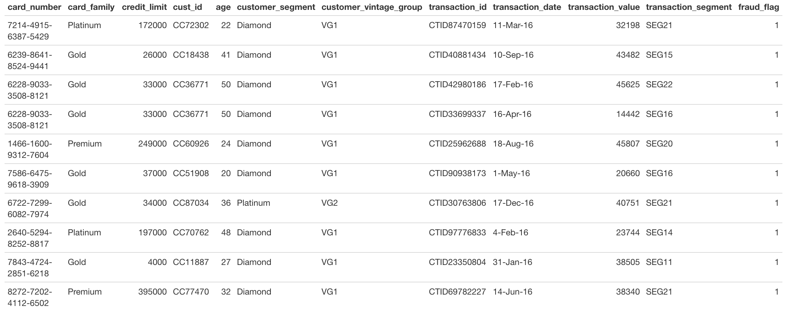

```{r setup, include=FALSE}
knitr::opts_chunk$set(echo = TRUE)
```

```{r}
library(tidyverse)
library(janitor)
```


<br>

The data for the joining tasks is from [Kaggle](https://www.kaggle.com/ananta/credit-card-data) and contains synthetic (fake) credit card information and transactions. The data for the `tidyr` tasks is also synthetic.

# MVP

## Joins

<br>
**Question 1**

Read in all 4 credit card transaction datasets and clean column names.

**Question 2**

Join the data containing card details and customer details by customer id, so that all records of card details and any matching records in customer details are kept. Before you run the code, think about how many rows you expect to see after joining.

**Question 3**

Join the data containing fraud details with transaction details so all rows of both tables are kept. What does the resulting row number tell you?

**Question 4**

Join the data containing card details with transaction details so rows from the first which have matching ones in the second are returned, but only return rows in the first table once.

## `tidyr`

**Question 5**

Read in `hat_observations` and separate `observation` into two columns, `hat_colour` and `hat_type`.


**Question 6**

Unite `day`, `month`, and `year` columns into a column called `date` using a suitable separator. Then find the date where the most berets were observed.


# Extension

## Joins

**Question 1**

Can you join all 4 datasets together so that you're left with a dataset that looks like below with **109 rows** and **12 columns**?



## `tidyr`

**Question 2**

Read in `exam_scores` and transform it into long format with two new columns `exam_question` and `score`. Then, using `separate` and `select`, remove superfluous information from the values in `exam_question`

# Answers

## MVP

### Joins

**Question 1**

Read in all 4 credit card transaction datasets and clean column names

```{r}
card <- read_csv("data/CardBase.csv") %>% 
  clean_names()
customer <- read_csv("data/CustomerBase.csv") %>% 
  clean_names()
fraud <- read_csv("data/FraudBase.csv") %>% 
  clean_names()
transaction <- read_csv("data/TransactionBase.csv") %>% 
  clean_names()
```

**Question 2**

Join the data containing card details and customer details by customer id, so that all records of card details and any matching records in customer details are kept. Before you run the code, think about how many rows you expect to see after joining.

I'd expect 500 rows here -- one for every card.

```{r}
card %>% 
  left_join(customer, "cust_id")
```

**Question 3**

Join the data containing fraud details with transaction details so all rows of both tables are kept. What does the resulting row number tell you?

```{r}
fraud %>% 
  full_join(transaction)
```


Resulting row number suggests the number of cases of fraud is less than or equal to the number of transactions, since the row count is still the 10,000 from `transaction`

**Question 4**

Join the data containing card details with transaction details so rows from the first which have matching ones in the second are returned, but only return rows in the first table once.

```{r}
card %>% 
  semi_join(transaction, by = c("card_number" = "credit_card_id"))
```

### `tidyr`

**Question 5**

Read in hat_observations and separate observation into two columns, hat_colour and hat_type.

```{r}
hat_observations <- read_csv("data/hat_observations.csv") %>% 
  clean_names()
```

```{r}
hat_observations_separated <- hat_observations %>% 
  separate(observation, c("hat_colour", "hat_type"), sep = "\\,")
```

**Question 6**

Unite `day`, `month`, and `year` columns into a column called date using a suitable separator. Then find the date where the most berets were observed.

```{r}
hat_observations_united <- hat_observations_separated %>% 
  unite(date, c("day", "month", "year"), sep = "/")

hat_observations_united %>% 
  filter(hat_type == "beret") %>% 
  slice_max(observation_count)

## This only gets the one colour -- what happens if multiple colours of beret on the same day?

hat_observations_united %>% 
  filter(hat_type == "beret") %>% 
  group_by(date) %>% 
  summarise(date, observation_count = sum(observation_count)) %>% 
  ungroup() %>% 
  distinct(date, observation_count) %>% 
  slice_max(observation_count)
```

Same day but there was actually 2 more berets!

## Extension

### Joins

**Question 1**

```{r}
card %>% 
  left_join(customer) %>% 
  left_join(transaction, by = c("card_number" = "credit_card_id")) %>% 
  inner_join(fraud)
```

```{r}

```

### `tidyr`

**Question 2**

Read in exam_scores and transform it into long format with two new columns exam_question and score. Then, using separate and select, remove superfluous information from the values in exam_question

```{r}
exam_scores <-  read_csv("data/exam_scores.csv") %>% 
  clean_names()
```

```{r}
exam_scores %>% 
  pivot_longer(-id, names_to = "exam_question", values_to = "score") %>% 
  separate(exam_question, c("exam", "exam_question"), sep = "q") %>% 
  select(-exam)
```
